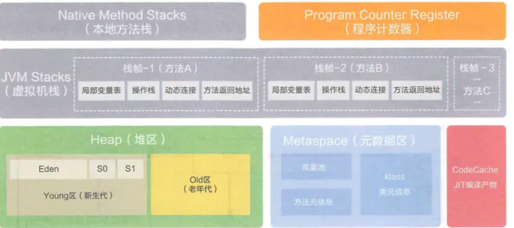

# 内存布局

## Heap（堆区）

> 存放着几乎所有实例对象，由GC自动回收，子线程共享使用
>
> 堆初始值、最大值设定：-Xms（memory start），-Xmx（memory max）。一般情况下初始值和最大值设相同——避免在GC后堆大小调整带来的系统压力

### 分布

默认内存大小比例：Young : Old = 1 : 2；Eden:Survivor=8:2；Survivor中的S0:S1=1:1

#### Young（新生代）

* Eden：大多数对象在Eden区生成，当Eden装满时，触发YGC（Young Garbage Collection），Eden中没有被引用的对应直接回收，依然存活的对象移送到Survivor区。如果要移送的对象Survivor装不下，则直接已送到Old区

* Survivor：存在一个计数器，当某个对应在S0、S1区间的交换次数超过某个阈值（默认15），则会被移至Old区
  * S0
  * S1

#### Old（老年代）

Old区分配不下当前对象，则触发FGC（Full Garbage Collection）；如果依然放不下该对象，则OOM

## Metaspace（元空间）

元空间在本地内存中分配

## JVM Stack（虚拟机栈）

描述Java方法执行的内存区域，线程私有

* 局部变量表
* 操作栈
* 动态链接
* 方法返回地址

## Native Method Stack（本地方法栈）

本地方法栈为Native方法服务，比如`System.currentTimeMillis()`

## Program Counter Regiester（程序计数寄存器）

PC计数器，存放执行指令的偏移量和行号指示器，线程恢复和执行依赖该计数器

## 线程私有和共享

* 堆和元空间线程共享
* 虚拟机栈、本地方法栈、PC计数器线程私有

# Jvm dump jstack jmap jstat使用

## jstack

## jmap

## jstat

# GC机制

## Parallel GC

## Mark-Sweep GC

